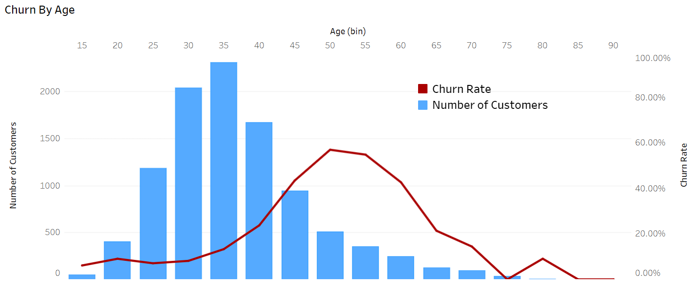
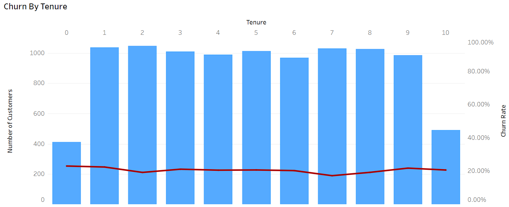
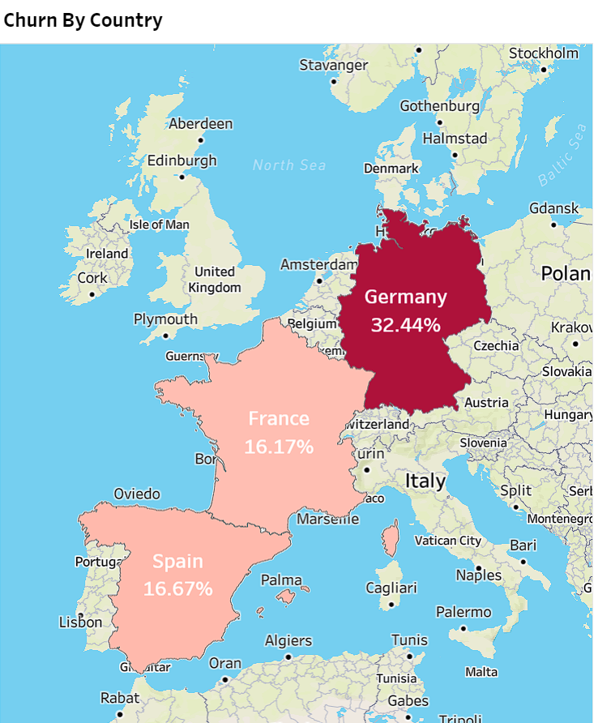
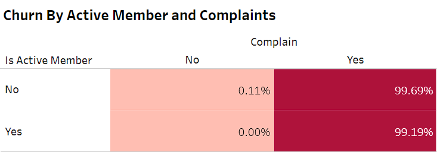
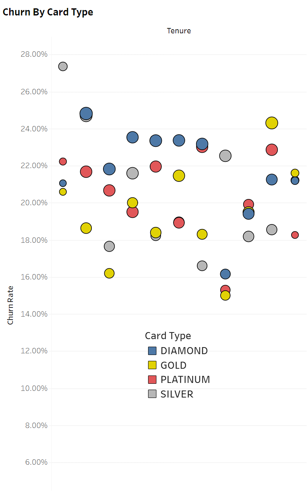
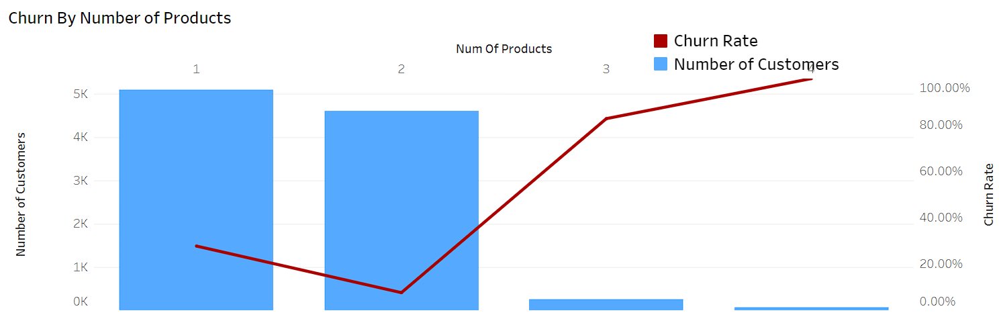
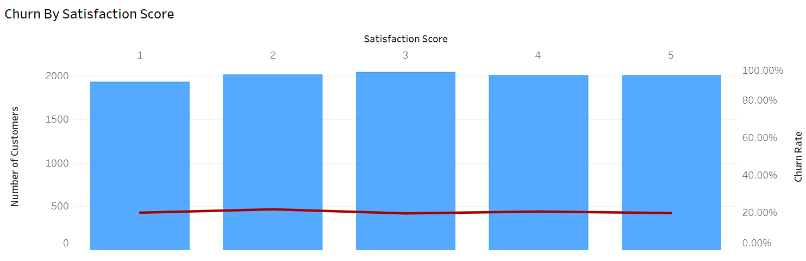
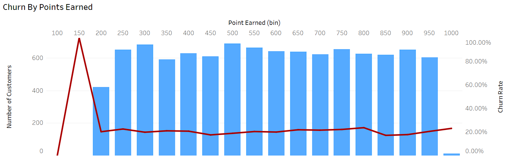

# Bank-Customers-Churn-Analysis

## Introduction
This is a Tableau project on churn analysis of an imaginary bank dataset.
The project aims to uncover the underlying reasons why customers choose to leave the bank. 
Customer churn analysis is crucial for understanding the factors that drive customers away, enabling the bank to take informed actions to reduce churn, enhance customer satisfaction, and optimize its operations.
***

## Problem Statement
The primary challenge addressed in this project is to identify and understand the motivations and reasons behind customer churn within the bank. By analyzing various customer attributes and behaviors, we seek to answer the question: **"Why do bank customers choose to churn?"** This understanding will enable the bank to develop targeted strategies to mitigate churn and strengthen customer relationships.
***

## Data Sourcing
### Data Description
The dataset used for this analysis consists of 18 fields (columns) and 10,000 rows, representing customer information and behavior within the bank. Key columns in the dataset include customer demographics, credit scores, account balances, product ownership, tenure, and whether a customer has churned or not.

### Data Collection
The dataset used for this analysis was obtained from Kaggle. You can access the dataset [here](https://www.kaggle.com/datasets/mathchi/churn-for-bank-customers).
***

## Data Cleaning / Transformation
Prior to analysis, data cleaning was performed to address issues such as missing values, data inconsistencies, and irrelevant columns. This step ensures that the dataset is in a suitable format for analysis.

The following key metrics were calculated to both help identify data quality issues, and provide context for subsequent analysis:
- Number of records: COUNT([Customer Id])
- Number of Unique Customers: COUNTD([Customer Id])
- Number of Churned Customers
- Churn Rate
- Average Number of Products per Customer
- Average Customer Age
***

## Data Analysis and Visualizations
You can explore the interactive visualizations and the complete dashboard on Tableau Public [here](https://public.tableau.com/views/BankCustomersChurnAnalysis_16941778446680/BankCustomersChurnAnalysis?:language=en-US&:display_count=n&:origin=viz_share_link).

### ***Analyzing Churn Patterns***

We begin by exploring how age relates to churn rates. Visualizing churn rates across different age groups helps us understand if certain age ranges are more prone to churning.

--> Customers between 45 and 60 tend to churn at a higher rate.

--> Tenure (years as a bank client) was examined, indicating relatively consistent churn rates across all tenures.
***

### ***Examining Geographic Differences***

--> Geographical differences were explored using a map visualization, highlighting a significantly higher churn rate in Germany compared to France and Spain.
***

### ***Impact of Customer Activity and Complaints***

We explore how customer activity and complaints relate to churn rates. 

--> Hypotheses regarding active customer status and complaints were confirmed through a heatmap. Active customers with no complaints were less likely to churn, while inactive customers with complaints were more likely to churn.
***

### ***Card Type and Churn***

--> Churn rates were analyzed across card types and tenure. For customers with up to 7 years of tenure, gold cardholders exhibited the lowest churn rates, while diamond cardholders had the highest.
***

### ***Churn Across Product Ownership, Satisfaction Score, and Points Earned***

--> Churn rates were examined based on the number of products owned, revealing that customers with three or four products churned more frequently.

--> Surprisingly, churn rates remained relatively stable across different satisfaction scores.

--> Churn rates in relation to customer points earned indicated that customers with fewer points were more likely to churn.

 
